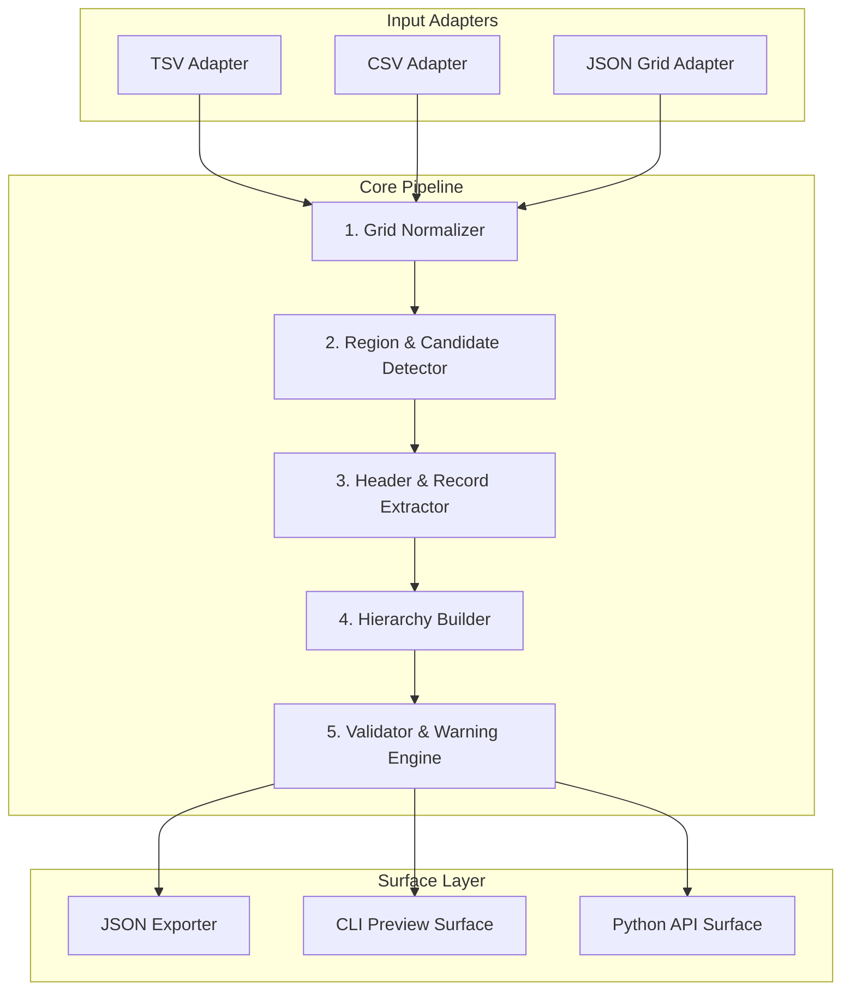

# Spatial Sheet Parser — Architecture Specification

## 1. System Overview

Spatial Sheet Parser is a deterministic spatial analysis library designed to transform semi-structured 2D grid matrix data (from TSV, CSV, Google Sheets, or raw JSON grids) into a validated, hierarchical JSON tree representation while preserving complete traceability to original source coordinates.



---

## 2. Core Architectural Principles

1. **Zero Silent Data Loss:** Every cell and row in the input matrix MUST either be classified into a structured table or captured in `unclassified_rows` with appropriate warning codes.
2. **Deterministic-First:** Table discovery and hierarchy resolution rely on explicit rules (column offsets, anchor column headers, title markers, indentation level). AI fallback is strictly reserved for disambiguating edge cases.
3. **Preservation of Raw Values:** Original values and source coordinates (`title_cell`, `data_range`, `header_row`, `record_start_row`, `record_end_row`) are strictly preserved without rounding or lossy mutation.
4. **Decoupled Parser Core:** The parsing pipeline logic operates purely on memory grid models and has zero dependency on UI, web servers, or external services.

---

## 3. Module Boundaries & Pipeline Layers

### 3.1 Input Adapters (`spatial_sheet_parser.adapters`)
* **Responsibility:** Ingest raw input formats (TSV strings, CSV files, JSON 2D arrays) and normalize them into a uniform `Grid` object.
* **Key Components:**
  * `TSVAdapter`: Parses tab-separated values.
  * `CSVAdapter`: Parses comma-separated values.
  * `JSONGridAdapter`: Parses standard 2D array structures with cell value and merged cell info.

### 3.2 Detection Engine (`spatial_sheet_parser.detection`)
* **Responsibility:** Identify Table of Contents (TOC), explicit markers (e.g. `[BEGIN DATA]`, `[TABLE]`), table title candidates across configured `title_columns`, header row positions at anchor columns (`title_column + table_offset`), and data range boundaries based on `max_blank_rows`.
* **Key Components:**
  * `MarkerDetector`: Scans for explicit spatial delimiters.
  * `TitleCandidateDetector`: Evaluates spatial evidence for table title rows.
  * `TableBoundaryDetector`: Computes data boundaries and record ranges.

### 3.3 Hierarchy Engine (`spatial_sheet_parser.hierarchy`)
* **Responsibility:** Resolve parent-child table relationships based on spatial indentation (column index of title cells).
* **Rules:**
  * Node level equals the index of the title column.
  * Parent is the closest preceding table with a lower level.
  * Level jumps do not create dummy synthetic nodes; tables are attached to the nearest ancestor with a `LEVEL_SKIPPED` warning.
  * Unparented tables are categorized into `orphan_tables`.

### 3.4 Validation & Warning Engine (`spatial_sheet_parser.validation`)
* **Responsibility:** Evaluate structural completeness, generate warning diagnostics, verify confidence scores, and enforce schema contract integrity.
* **Taxonomy of Warning Codes:**
  * `AMBIGUOUS_TABLE_TITLE`: Candidate title lacks sufficient supporting spatial evidence.
  * `MISSING_HEADER`: Table candidate detected without a valid header row.
  * `EMPTY_RECORDS`: Header row found but no records present in data range.
  * `DUPLICATE_HEADER`: Multiple columns share identical header labels.
  * `LEVEL_SKIPPED`: Indentation jumped more than one level without intermediate parent.
  * `ORPHAN_TABLE`: Table has no valid parent in hierarchy.
  * `UNEXPECTED_BLANK_ROW`: Blank row encountered within record region.
  * `POSSIBLE_FOOTER`: Single-cell row or total summary row detected after records.
  * `MERGED_CELL_DETECTED`: Merged cells encountered (handled via policy, e.g. `top_left_only`).
  * `TRUNCATED_TABLE`: Table boundary truncated by explicit marker or EOF.
  * `UNCLASSIFIED_DATA`: Non-empty cell/row not included in any table structure.

### 3.5 Presentation & Export (`spatial_sheet_parser.presentation`)
* **Responsibility:** Format final output into standard JSON contract, render terminal previews, and manage CLI/API surface responses.

---

## 4. Contract Specifications

### 4.1 Parser Configuration Contract (`ParserConfig`)

Default configuration matching product specification:

```json
{
  "title_columns": [0, 1, 2],
  "table_offset": 1,
  "max_blank_rows": 1,
  "header_rows": 1,
  "explicit_markers": ["[BEGIN DATA]", "[TABLE]"],
  "merged_cell_policy": "top_left_only",
  "strictness": "balanced"
}
```

### 4.2 Standard Output JSON Contract

```json
{
  "metadata": {
    "parser_version": "1.0.0",
    "source_format": "tsv",
    "sheet_name": null,
    "toc_summary": [],
    "data_start_row": 0,
    "warnings": []
  },
  "tables": [
    {
      "table_id": "tbl_001",
      "title": "Category A",
      "level": 0,
      "parent_id": null,
      "title_cell": {"row": 2, "col": 0},
      "anchor_column": 1,
      "data_range": {"start_row": 2, "start_col": 0, "end_row": 10, "end_col": 4},
      "header_row": 3,
      "record_start_row": 4,
      "record_end_row": 10,
      "columns": ["col_1", "col_2"],
      "records": [
        {"col_1": "Val 1", "col_2": "Val 2"}
      ],
      "children": [],
      "confidence": 1.0,
      "warnings": []
    }
  ],
  "orphan_tables": [],
  "unclassified_rows": []
}
```

---

## 5. Python API & CLI Surface Contracts

### 5.1 Python API Contract

```python
from typing import Any, Dict, List, Optional
from dataclasses import dataclass

@dataclass
class ParserConfig:
    title_columns: List[int]
    table_offset: int
    max_blank_rows: int
    header_rows: int
    explicit_markers: List[str]
    merged_cell_policy: str
    strictness: str

class SpatialSheetParser:
    """Core entry point for spatial spreadsheet parsing."""

    def __init__(self, config: Optional[ParserConfig] = None) -> None:
        self.config = config or ParserConfig()

    def parse_grid(self, grid: List[List[Any]], source_format: str = "raw") -> Dict[str, Any]:
        """Parses a 2D matrix grid into structured JSON result tree.
        
        Note: Interface contract stub. Full implementation target: SSP-002+.
        """
        raise NotImplementedError("SpatialSheetParser core will be implemented in task SSP-002.")
```

### 5.2 CLI Surface Contract

Command invocation:
```bash
spatial-sheet-parser parse <input_file> [options]
```

Options:
* `--format, -f`: Input format (`tsv`, `csv`, `json`). Defaults to auto-detect.
* `--config, -c`: Path to custom JSON configuration file.
* `--out, -o`: Path to save output JSON file.
* `--preview`: Output human-readable summary of tables and warnings to stdout.
* `--version, -v`: Display installed version.

---

## 6. Implementation Roadmap

* **SSP-001 (Current):** Skeleton bootstrap, architecture specification, CLI/API contract definition, smoke tests.
* **SSP-002:** Deterministic parser core implementation (normalization, detection, boundaries, hierarchy).
* **SSP-003:** Schema validation, contract output generation, warnings taxonomy engine.
* **SSP-004:** Preview presentation layer and CLI commands execution.
* **SSP-005:** Integration testing, real-world spreadsheet fixtures, performance hardening.
